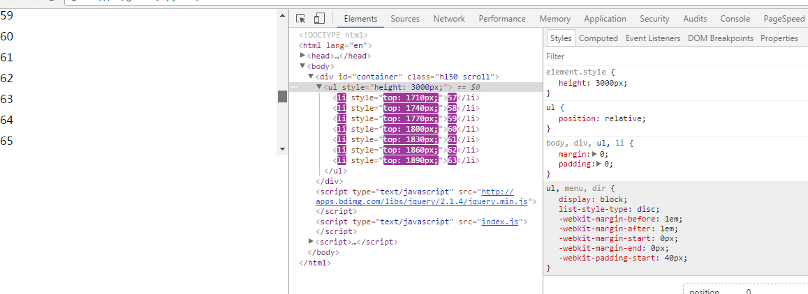
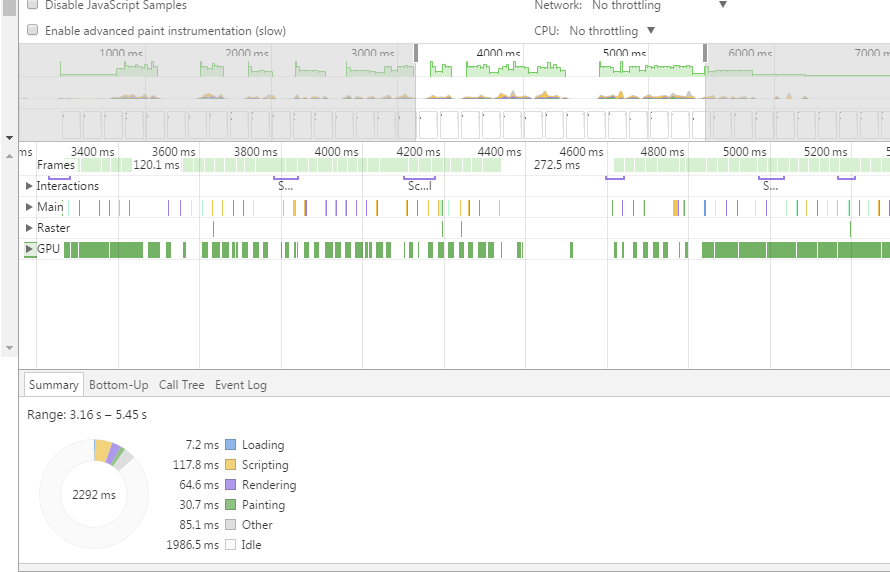

## 向ul中添加10000个li，如何优化页面？

**思路：**
    添加的li很多，但受限于页面的高度，要展示的li却是固定的，必然会出现滚动条，而且把所有的li全部添加到页面中，滚动条滚动也会出现卡顿，不流畅的感觉。因此我的想法是`不添加所有的li到ul里` ，通过计算container的高度，得出要展示的li的个数,只添加需要展示li的个数，在滚动时，通过绝对定位，根据scrolltop来设置top值，然后替换li中的数据即可。

### 步骤：

1.建立一个处理此过程的类：
```
/**
 * [List description] 处理添加li
 * @param {[dom]} container  [description] 
 * @param {[array]} items      [description] 添加进container的item数据
 * @param {[number]} itemHeight [description] 每个li的高度
 */
var List = function(container ,items, itemHeight){
    this.container = container;
    this.items = items;
    this.itemHeight = itemHeight;
    this.init();
    this.update();
}

```

2. container的高度固定为想展示li个数的高度——比如：li的height为30px，每次只展示5个，即为150px，设为overflow-y：scroll；即可模拟出滚动条;
``` 
    .container{
        height: 150px;
        overflow-y: scroll;
    }
```

3.根据container的高度算出能容纳li的最大个数 
```
/**
 * [_maxLength description] 根据container的高度算出能容纳li的最大个数
 * @return {[type]} [description]
 */
List.prototype._maxLength = function(){
    //container的高度，算出显示的item的数量
    var h = this.container.offsetHeight;
    var len = Math.min(Math.ceil(h/this.itemHeight), this.items.length);
    return len;
};

```
4. 根据_maxLength，填充li,
```
List.prototype.init = function(){
    this.ul = document.createElement('ul');
    var len = this._maxLength();
    var html = '', _self = this;
    for(var i = 0; i < len; i++){
        html += '<li>'+this.items[i]+'</li>';
    }
    this.ul.innerHTML = html;
    this.container.appendChild(this.ul);
    ////...
};

```
5. 设置滚动事件。
```
this.container.addEventListener('scroll', function(){
    _self.update();
}, false);
```
6. 给ul，li添加定位的样式
```
 ul{
        position: relative;
    }
    li{
        position: absolute;
    }
```
7.设置ul的高度，和滚动时li的top值,替换li中的值
```
List.prototype.update = function(){
    //ul的长度为所有li的总长度
    var height = this.items.length * this.itemHeight + "px";
    if(this.ul.style.height !== height){
        this.ul.style.height = height;
    }
    //通过滚动条的高度，算出起始的item
    var scrollTop = this.container.scrollTop;
    var start = Math.floor(scrollTop/this.itemHeight);

    var items = this.ul.children;
    var len = this._maxLength();
    for(var i = 0; i < len; i++){
        var item = items[i];
        if(!item){
            item = items[i] + document.createElement('li');
            this.ul.appendChild(item);
        }
        var index = start + i;
        //替换内容，更新top
        item.innerHTML = this.items[index];
        item.style.top = this.itemHeight * index + 'px';
    }
}
```


### 结果：



### 优化效果：



